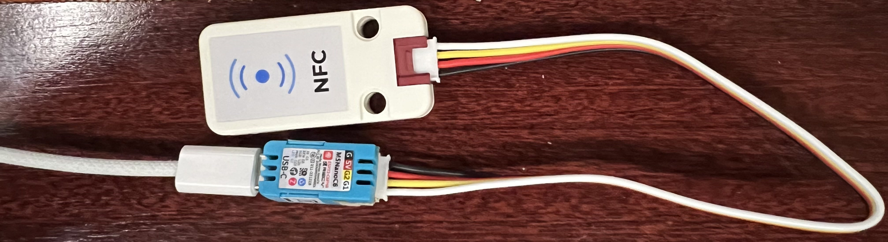

# M5Stack NanoC6 Aliro NFC Reader

Experimental Aliro-compatible NFC reader and Matter door-lock reference for the
[M5Stack NanoC6](https://docs.m5stack.com/en/core/M5NanoC6) and
[M5Stack Unit NFC](https://docs.m5stack.com/en/unit/Unit_NFC).

This project adapts Espressif's `esp-matter` door-lock example for the NanoC6,
provisions Apple Home Key credentials through Matter, and attributes a successful
Aliro NFC unlock to the corresponding Matter user and credential.



## Why Matter identifies it as a door lock

This hardware is an NFC credential reader, not a lock actuator. It deliberately
exposes the Matter **Door Lock** device type (`0x000A`) because the current
[Matter device-type list](https://project-chip.github.io/connectedhomeip-doc/ids_and_codes/spec_device_types.html)
does not define an access keypad or credential-reader device type. Matter's
similarly named Keypad Input cluster is intended for media-control key input,
not physical access control.

Aliro provisioning is part of the Matter Door Lock cluster. The standard user,
credential, Aliro reader configuration, and `LockOperation` data used by this
project are all defined there. The Door Lock Controller device type is not an
alternative: it represents a client that controls another lock rather than a
reader that hosts credentials. See the CSA
[Matter Application Cluster Specification](https://csa-iot.org/wp-content/uploads/2025/08/3-27350_matter-1-4-2-adopted-application-cluster-specification.pdf)
for the Door Lock and Aliro commands.

A custom vendor-specific keypad type would require custom controller support
and would lose standard Aliro provisioning in ecosystems such as Apple Home.
The firmware therefore keeps the interoperable Door Lock model while using
`M5Stack NanoC6 Aliro Reader` as its product name and `Aliro NFC Reader` as its
node label. Controllers may still render a lock control because presentation is
based on the standard Matter device type.

## What works

- Matter commissioning over a persistent, pre-commissioning choice of Thread or
  Wi-Fi
- Apple Home Key provisioning through Apple Home
- Aliro NFC standard and fast transactions
- M5Stack Unit NFC over I2C using its ST25R3916 controller
- Matter user and endpoint-credential persistence
- Aliro credential attribution without logging raw keys
- A Matter `LockOperation` event containing the resolved `userIndex`, credential
  type, and credential index
- Automatic relocking from the upstream example

The tested credential was resolved as an Aliro evictable endpoint key. The
implementation also handles non-evictable endpoint keys.

## Tested stack

| Component | Tested version |
| --- | --- |
| Hardware | [M5Stack NanoC6](https://docs.m5stack.com/en/core/M5NanoC6) + [M5Stack Unit NFC](https://docs.m5stack.com/en/unit/Unit_NFC) |
| ESP-IDF | `v6.0.2` |
| esp-matter | `59574f3fb62fddc690b4127fd3a4a43cfce4245e` |
| connectedhomeip submodule | `539342f32d5f4dc93761c2f9325afe29270068f1` |
| esp-aliro NFC component | `db6bc8ea93854b730b9163d2472dfa7bff86a280` |
| esp_aliro_lib | `^1.2.0` |

The reference build uses GPIO 2 for SDA, GPIO 1 for SCL, GPIO 9 for the button,
and GPIO 20 for the RGB LED.

## Repository layout

- `patches/0001-nanoc6-aliro-credential-attribution.patch` contains the
  Aliro credential-attribution changes.
- `patches/0002-selectable-wifi-thread-mode.patch` adds the persistent
  Wi-Fi/Thread selector, button gestures, boot indication, and the 4 MB
  single-application partition layout required by the dual-transport build.
- `config/sdkconfig.defaults.nanoc6_aliro_nfc` contains the tested ESP32-C6,
  Wi-Fi, Thread, console, board, and NFC configuration.
- `SECURITY.md` documents the security boundary and production caveats.

No firmware image, flash dump, Matter fabric data, PIN, private key, persistent
Aliro key, network address, or commissioned-device state is included.

## Install the prerequisites and SDKs

The commands below follow the official
[ESP-IDF installation guide](https://docs.espressif.com/projects/esp-idf/en/latest/esp32/get-started/)
and the
[ESP-Matter development guide](https://docs.espressif.com/projects/esp-matter/en/latest/esp32/developing.html).

### macOS

Install the Xcode command-line tools and Homebrew packages:

```bash
xcode-select --install
brew install libgcrypt glib pixman sdl2 libslirp dfu-util cmake ninja ccache python
```

### Ubuntu or Debian

Install the ESP-IDF and Matter host dependencies:

```bash
sudo apt-get update
sudo apt-get install -y \
  git gcc g++ flex bison gperf pkg-config cmake curl wget ccache ninja-build \
  python3 python3-venv python3-dev python3-pip libssl-dev libffi-dev \
  libdbus-1-dev libglib2.0-dev libavahi-client-dev unzip \
  libgirepository1.0-dev libcairo2-dev libreadline-dev libevent-dev \
  default-jre dfu-util libusb-1.0-0
```

Matter requires Python 3.11 or newer. Ubuntu 22.04 users may need to install
Python 3.11 separately before continuing.

### ESP-IDF 6.0.2 and ESP-Matter

Install the exact versions used by this project:

```bash
mkdir -p ~/esp
cd ~/esp

git clone --recursive --branch v6.0.2 \
  https://github.com/espressif/esp-idf.git
cd esp-idf
./install.sh
source ./export.sh
cd ..

git clone https://github.com/espressif/esp-matter.git
cd esp-matter
git checkout 59574f3fb62fddc690b4127fd3a4a43cfce4245e
git submodule update --init --recursive
./install.sh
source ./export.sh
```

Source both environments whenever you open a new terminal:

```bash
source ~/esp/esp-idf/export.sh
source ~/esp/esp-matter/export.sh
```

## Build and flash

From the checked-out `~/esp/esp-matter` directory:

```bash
cd ~/esp/esp-matter

git apply /path/to/m5stack-nanoc6-aliro-reader/patches/0001-nanoc6-aliro-credential-attribution.patch
git apply /path/to/m5stack-nanoc6-aliro-reader/patches/0002-selectable-wifi-thread-mode.patch
cp /path/to/m5stack-nanoc6-aliro-reader/config/sdkconfig.defaults.nanoc6_aliro_nfc \
  examples/door_lock/sdkconfig.defaults.nanoc6_aliro_nfc

cd examples/door_lock
idf.py -D SDKCONFIG_DEFAULTS=sdkconfig.defaults.nanoc6_aliro_nfc set-target esp32c6
idf.py build
idf.py -p /dev/your-device-port flash monitor
```

The ESP-IDF component manager downloads the declared Aliro and M5Stack NFC
dependencies during configuration.

## Select Wi-Fi or Thread before commissioning

The firmware compiles both transports but starts exactly one of them. Thread is
the default after the first flash and after a factory reset. The selected mode
is stored in NVS and survives normal reboots.

At boot, the NanoC6 RGB LED shows the selected transport for approximately 1.2
seconds:

- blue: Thread
- cyan: Wi-Fi

Use the NanoC6 button before adding the reader to a Matter fabric:

- one click: toggle the example lock state, as in the upstream door-lock sample
- five consecutive clicks: perform a full Matter factory reset, erase fabric,
  network, and provisioned Aliro credential state, and restore Thread as the
  default transport
- eight consecutive clicks: toggle Thread/Wi-Fi, show the newly selected color,
  and reboot into that mode

The eight-click selector is accepted only while the device has no commissioned
Matter fabric. If it is already paired, first use the five-click factory reset,
then use eight clicks to select the other transport. Multi-click actions run
only after the click sequence has ended, so the five-click action does not fire
on the way to eight clicks.

## Commissioning and validation

1. Flash the firmware and use the Matter onboarding information printed by the
   example to add the lock to Apple Home or another compatible Matter
   controller. Select Wi-Fi or Thread with the button before this step.
2. Allow Apple Home to provision Home Key credentials.
3. Present the iPhone or Apple Watch to the NFC reader.
4. Confirm that the serial log reports a successful Aliro transaction and a
   resolved Matter user and credential index.

Expected log shape, with example-only identifiers:

```text
Aliro NFC transaction completed successfully
Aliro credential resolved: user=<user-index> credential-type=<type> credential-index=<index>
Unlock event: source=aliro user=<user-index> credential-type=<type> credential-index=<index>
```

Raw credential data is deliberately not printed.

The diagnostic console can inspect capacity and user-to-credential references:

```text
matter esp dl status
matter esp dl users
```

### Android and Samsung Wallet

Aliro is platform-neutral at the reader protocol level. Samsung Wallet's
[Digital Home Key](https://news.samsung.com/global/samsung-wallet-launches-digital-home-key-for-smart-door-locks)
uses Aliro and can provide NFC tap-to-unlock on supported Samsung Galaxy devices.
A compatible Matter lock is commissioned through SmartThings, after which the
onboarding flow may offer adding a Digital Home Key to Samsung Wallet.

This repository has not yet been validated with Samsung Wallet. Availability may
depend on the Galaxy model, region, SmartThings and Samsung Wallet rollout, and
whether Samsung accepts the lock implementation. A generic NFC-enabled Android
phone is not sufficient: it must hold an Aliro credential provisioned by a
compatible wallet or access-management system.

## Attribution design

The Aliro SDK stores the public access-credential key associated with a fast
transaction in its NVS-backed persistent-key cache. After a successful
transaction, the patch locates the most recently used cache entry, reads only
its public key, and compares it in memory with the enabled Matter users'
provisioned Aliro endpoint credentials. A successful match is attached to the
Matter `LockOperation` event.

This avoids exposing credential material in logs while making the event useful
to a Matter controller or higher-level automation system.

## Important limitations

- This is a reference implementation, not a production access-control product.
- The 4 MB NanoC6 flash cannot hold two copies of the dual-transport firmware.
  This build therefore uses one large factory application partition and does
  not provide two-slot OTA updates or OTA rollback. Updating it requires a
  wired flash unless a different, sufficiently large flash layout is used.
- Runtime switching is intentionally unsupported. The transport can only be
  changed while the reader is uncommissioned and takes effect after reboot.
- The transport selector patches internal `esp-matter` startup and Network
  Commissioning integration at the pinned commit. Revalidate it after any SDK
  upgrade.
- The attribution code currently relies on the internal NVS schema used by the
  tested `esp_aliro_lib` version. Revalidate it after any SDK upgrade.
- The upstream door-lock example simulates actuator movement. Add independently
  reviewed hardware, safety, and failure handling before controlling a real door.
- Aliro controller behavior and credential layout may vary across ecosystems and
  future software releases.

## License and attribution

The original work in this repository is licensed under the MIT License. The patch
targets Espressif's `esp-matter` door-lock example; upstream files and dependencies
remain subject to their own licenses. See `NOTICE` for details.
